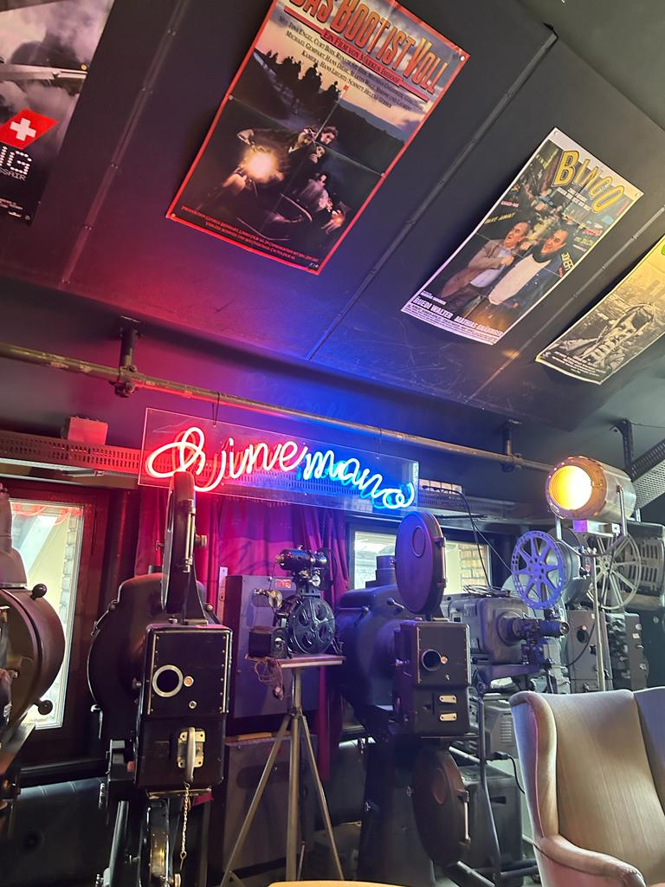

+++
title = "Die Rückkehr der Vergangenheit in die Gegenwart "
date = "2024-02-13"
draft = false
pinned = false
tags = []
image = ""
description = ""
footnotes = ""
+++


Während sich die Welt um uns verändert und die Technologie voranschreitet, bleibt die Geschichte der     Filme lebendig – das Lichtspiel-Team in Bern trägt dazu bei, diese Geschichte in ihrer ganzen Faszination am Leben zu erhalten. Jeden Tag zaubert das kleine Team in Bern wahre Magie, um anderen zu helfen, sich daran zu erinnern, wie die Filmindustrie in der Vergangenheit wirklich war. 



Während die Kaffeemaschine leise vor sich hin summt und sich in die Melodie des Ortes einfügt, zieht ein Hauch von Nostalgie durch die Luft. Dieser wird durchdrungen von den unzähligen alten Filmprojektoren, welche wie stumme Zeugen der Filmgeschichte die Räume umgeben. Ein gedämpftes Hallen von Schritten auf dem polierten Betonboden ist zu hören. Es ist ein Ort, der wie eine Zeitkapsel wirkt, voller Schätze und Geschichten, die sich in jedem Winkel verbergen. In den Tiefen von Bern, wo die Vergangenheit auf die Gegenwart trifft, verbirgt sich ein Ort, der mehr als nur ein Kino ist: die Kinemathek Lichtspiel. Hier, zwischen den schlichten Barhockern und den bequemen Kinosesseln, spürt man den Puls der Vergangenheit, der in den Schriftzügen der Neonlichter rhythmisch zu flackern scheint. Die Wände, geschmückt mit Filmplakaten, die wie Fenster in andere Welten wirken, erzählen von einer Zeit, in der das Kino noch ein Ereignis war, ein gesellschaftliches Spektakel. Ein gedämpftes Licht strömt durch das Oberlicht und schafft eine Atmosphäre, die zum Verweilen, Entdecken und Erkunden einlädt. In jeder Ecke, auf jedem Regal, in jeder Glasvitrine findet sich ein Stück Filmgeschichte, sei es eine alte Filmrolle, eine seltene Kamera oder eine vergessene Requisite. Hier verbindet sich die Liebe zum Detail mit der Leidenschaft für das Kino, und das Ergebnis ist ein lebendiges Museum, ein aktives Archiv, das nicht nur bewahrt, sondern auch belebt wird. Mit jedem Film, der hier vorgeführt wird, mit jeder Führung, die durch diese Räume geleitet wird, lebt die Geschichte weiter und inspiriert die Besucher, sich auf eine Reise durch die Zeit zu begeben.

**Archiv: Schätze bergen und Filme auf die Leinwand Zurückholen**

„Wir bringen Vergangenheit und Gegenwart zusammen, indem wir alte Filme in diesem einzigartigen Lichtspielhaus zeigen, und es ist eine Möglichkeit, Filmgeschichten aufleben zu lassen und die alten Schätze einem neuen Publikum zugänglich zu machen.“ Raff Fluri, der technische Leiter für Veranstaltungen und Ausstellungen der Kinemathek Lichtspiel steht zu diesem Zitat und findet, es trifft vollkommen auf die Kinemathek Lichtspiel zu. Es beschreibt die Institution treffend, da sie genau nach diesem Motto arbeitet und es versucht umzusetzen.

Ein Herzstück der Kinemathek ist das Filmarchiv, das aus etwa 25.000 Filmen besteht. Hierbei handelt es sich größtenteils um Kurzfilme, Werke, die in anderen Kinos oft keinen Platz mehr finden, aber hier  Aufmerksamkeit erhalten. Dazu gehören kleine Produktionen, experimentelle Werke, Animationsfilme, Musikvideos, Wochenschauen und Amateurfilmbeiträge. Diese Filme werden nach strengen Standards gesichtet, detailliert in die Datenbank aufgenommen und für die Archivierung vorbereitet. Das Archiv dient als zentrales Instrument für die Arbeit der Kinemathek, von dem aus private und öffentliche Filmprogramme ausgewählt werden (können). Verbunden mit den Katalogen der internationalen Vereinigung der Filmarchive (FIAF), trägt es zur Sichtbarkeit und Forschung bei. Zusätzlich zum Filmarchiv existiert ein Hardware-Archiv, das Gerätschaften zur Filmvorbereitung und -projektion aus verschiedenen Epochen sammelt und bewahrt. Diese Zeitzeugen werden erfasst, revidiert und im Schaulager untergebracht. Manchmal werden sie nach Wartung wieder in Betrieb genommen, während in anderen Fällen Ersatzteile für die Werkstatt gewonnen werden. Dies wird alles durch ein Team aus 27 Personen ermöglicht. In diesem engagierten Team, das sich fast wie eine Familie versteht, hilft jeder jedem, wie es in einem Interview mit einem Teammitglied (Raff Fluri) betont wurde: *"Da wir auch ein kleines Team sind und jeder jedem hilft, ist das hier fast schon wie eine kleine Familie."* Durch die funktionierende Teamarbeit wird es ermöglicht, das Archiv in Gang zu halten. 

Die Sammlung an Papierdokumenten bildet einen weiteren Teil des Archivs, reichend von Filmplakaten bis zu Handbüchern für verschiedene Geräte. Diese historischen Dokumente werden sorgfältig bewahrt, und auf Anfrage gewährt die Kinemathek Einsicht in diese Schätze. Ihr Ziel ist es, ein Archiv bereitzustellen, das zugänglich und lebendig bleibt, Sichtbarkeit besitzt und weiterhin genutzt wird, ohne dabei die Integrität der Archivbestände zu beeinträchtigen. Der Fokus liegt dabei auf der Bewahrung der Authentizität und Integrität des Kulturerbes. Die Digitalisierung sieht die Kinemathek Lichtspiel nicht als Ersatz, sondern als Ergänzung zur analogen Archivarbeit. Es werden Strategien entwickelt, um den besonderen Charme und die Atmosphäre des Lichtspiels auch im digitalen Raum zu bewahren. In diesem Sinne definiert sich die Kinemathek als ein modernes, vielseitig zugängliches und qualitativ hochwertiges Archiv.

**Museum: Bewahren und sichtbar machen** 

An der Sandrainstrasse 3 in Bern bringt das Lichtspiel-Team Filme aus der Vergangenheit zurück. In öffentlich zugänglichen Räumen werden Artefakte der Kinogeschichte gesammelt, bewahrt und präsentiert. Ein sich ständig veränderndes Schaulager beherbergt Maschinen, Utensilien von Filmsets und weiteres Kinomaterial. Projektoren in allen Formen und Farben, Visionierungstische, Kameras, Stative und Plakate. Zusätzlich prägt eine einzigartige Sammlung von Laterna Magicas das Erscheinungsbild des Lichtspiels. Diese umfangreiche Sammlung, grosszügig vom Nachlass von Heinz Leuenberger überlassen, ist in einem eigen dafür gestalteten Raum zu bewundern und dokumentiert eine wichtige Entwicklungsphase in der Geschichte der Kinemathek Lichtspiel. Die Kinemathek betrachtet das Museum als Vermittlungsort durch verschiedenste Versuchs Möglichkeiten. Die Sammlung und Konservierung der Objekte sind Hauptanliegen, aber ebenso wichtig ist es, die Gerätschaften funktionsfähig zu halten. Dies geschieht durch das Team des Lichtspiel Berns, doch wie im Interview durch Raff Fluri angedeutet steht nicht viel Geld zur Verfügung; *"Von mir aus gesehen ist man wirklich wegen dem Team auch da, weil viel Geld verdient man nicht, oder es ist nicht sehr viel Geld vorhanden für eine Institution wie unsere."* Um Geld geht es den Mitarbeitern der Kinemathek Lichtspiel nicht, der Schwerpunkt liegt auf der Erhaltung der Vergangenheit und wie ebenfalls erwähnt auf der guten Atmosphäre zwischen den Teammitgliedern, welche die Zusammenarbeit mit Gleichgesinnten ermöglichen. Die Restaurierungsprojekte dienen nicht nur der Erhaltung, sondern ermöglichen es auch, die Geräte für Vorführungen zu nutzen. 

 

Als Institution ist die Kinemathek Mitglied der Museen Bern und kooperiert mit anderen Museen auf verschiedenen Ebenen. Dennoch prägt das Lichtspiel einen eigenen "Museums-Ansatz" – verspielt, neugierig, begehbar, sichtbar, riechbar und hörbar. Die Kinemathek Lichtspiel bleibt somit nicht nur ein Ort der Vergangenheit, sondern auch ein lebendiger Raum für die Zukunft der Filmkultur.

 

- - -

